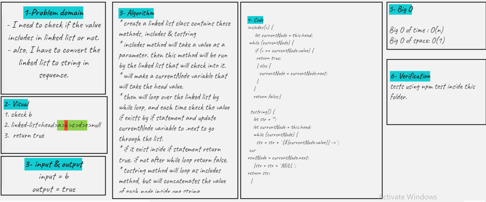

# Singly Linked List

- add includes and tostring methods
- includes will check a value if it exists in a linked list or not
- to string will return the linked list as a string contains all values

## Challenge

<!-- Description of the challenge -->

## Approach & Efficiency

<!-- What approach did you take? Why? What is the Big O space/time for this approach? -->

## API

<!-- Description of each method publicly available to your Linked List -->
