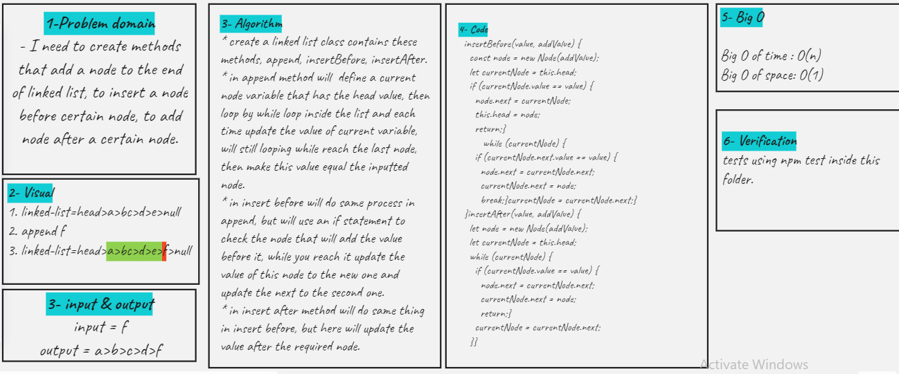

# Singly Linked List

- add append, insert before, and insert after methods
- append will add node to the end of the list
- insert before will add node before certain node in the list
- insert after will add node after certain node in the list

## Challenge

<!-- Description of the challenge -->

## Approach & Efficiency

<!-- What approach did you take? Why? What is the Big O space/time for this approach? -->

## API

<!-- Description of each method publicly available to your Linked List -->
