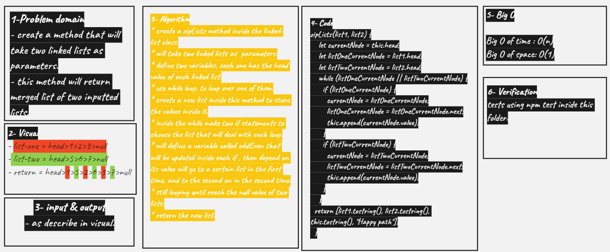

# Singly Linked List

- create zipLists method that will merge two linked lists togethor

## Challenge

<!-- Description of the challenge -->

**zipLists method**

## Approach & Efficiency

<!-- What approach did you take? Why? What is the Big O space/time for this approach? -->

<!--  -->

## API

<!-- Description of each method publicly available to your Linked List -->
