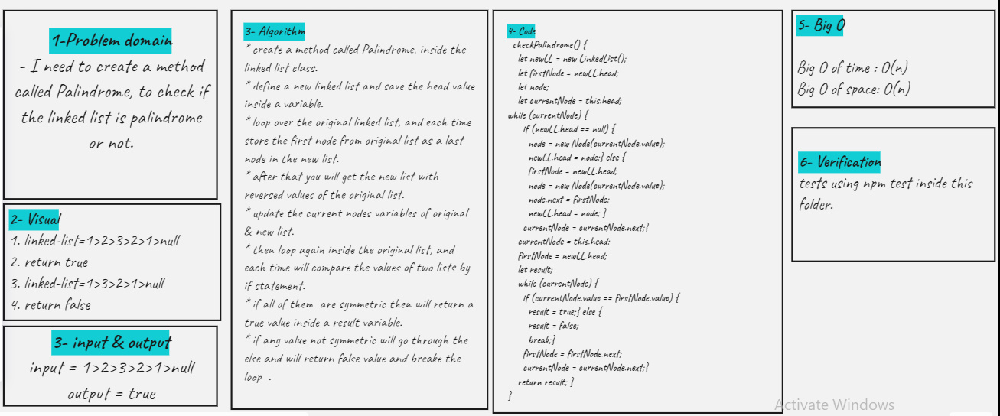

# Singly Linked List

- create Palindrome method that will check the list if it is palindrome or not

## Challenge

## Mock Interviews

- was with Hiba Salem

**Palindrome method**

## Approach & Efficiency

<!-- What approach did you take? Why? What is the Big O space/time for this approach? -->

<!--  -->

## API

<!-- Description of each method publicly available to your Linked List -->
