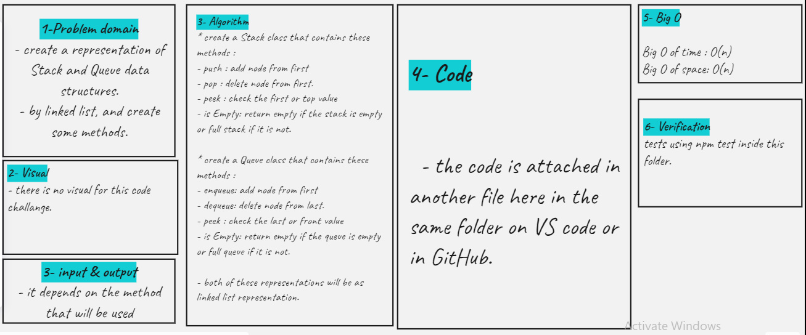

# Stacks & Queue

- create Stack data structure representaion by linked list and create some methods to add, delete, and check the stack.

- create Queue data structure representaion by linked list and create some methods to add, delete, and check the queue.

## Challenge

**Stacks & Queue**

## Approach & Efficiency

<!-- What approach did you take? Why? What is the Big O space/time for this approach? -->

<!--  -->

## API

<!-- Description of each method publicly available to your Linked List -->
