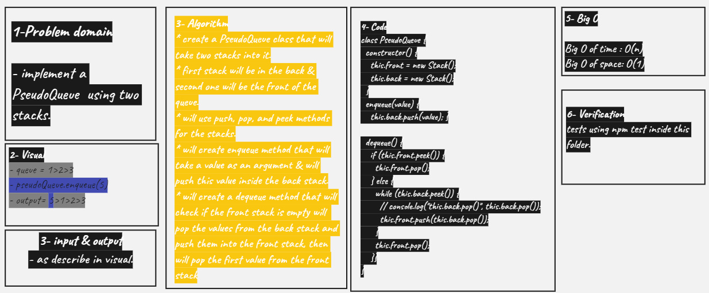

# PseudoQueue

- created a PseudoQueue by two stacks, by first in first out approach
- created enqueue & dequeue methods inside this class

## Challenge

**PseudoQueue**

## Approach & Efficiency

<!-- What approach did you take? Why? What is the Big O space/time for this approach? -->

<!--  -->

## API

<!-- Description of each method publicly available to your Linked List -->
