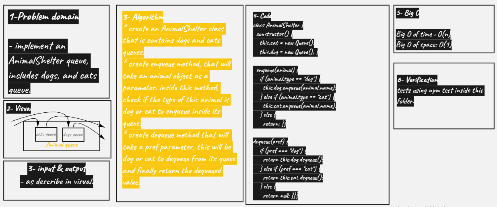

# Animal Shelter

- create First-in, First out Animal Shelter.

- this class will take cat & dog queues

## Challenge

**Animal Shelter**

## Approach & Efficiency

<!-- What approach did you take? Why? What is the Big O space/time for this approach? -->

<!--  -->

## API

<!-- Description of each method publicly available to your Linked List -->
