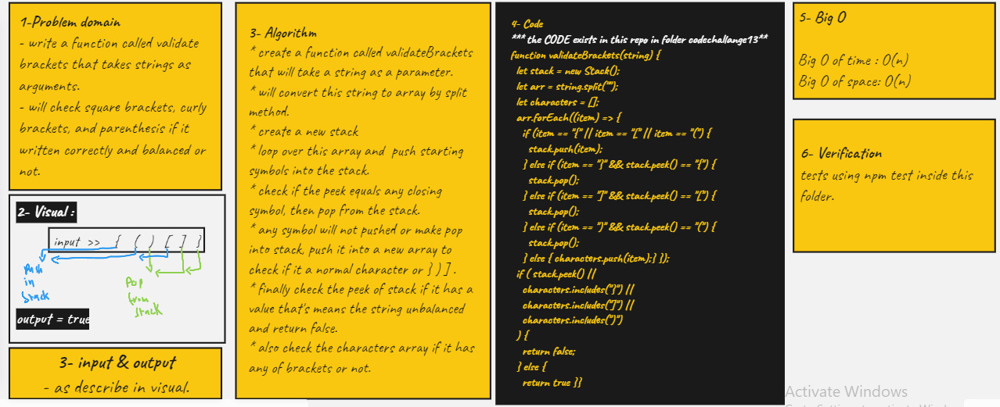

# stack-queue-brackets

## Challenge

**stack-queue-brackets**

- create a method called validate brackets that will check if the string are balanced according to brackets or not.

## Approach & Efficiency

<!-- What approach did you take? Why? What is the Big O space/time for this approach? -->

<!--  -->

## API

<!-- Description of each method publicly available to your Linked List -->
