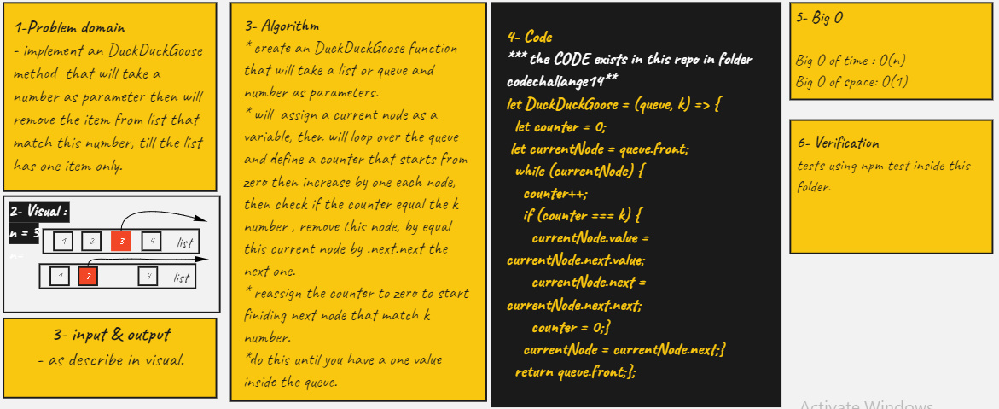

# Duck Duck Goose

## MOck interview

- Ahmad Abu Osbeh & Ahmad Ammoura

## Challenge

**Duck Duck Goose**

- create a method called duckduckgoose that recieves a queue and a number and will count elements by this number starting from the first element. each element will match its position this number will be deleted.

- will delete all elements except the final one.

## Approach & Efficiency

<!-- What approach did you take? Why? What is the Big O space/time for this approach? -->

<!--  -->

## API

<!-- Description of each method publicly available to your Linked List -->
