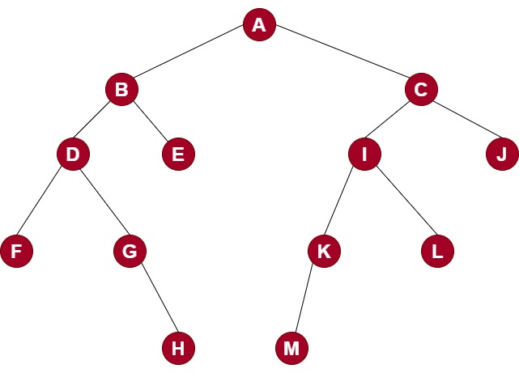
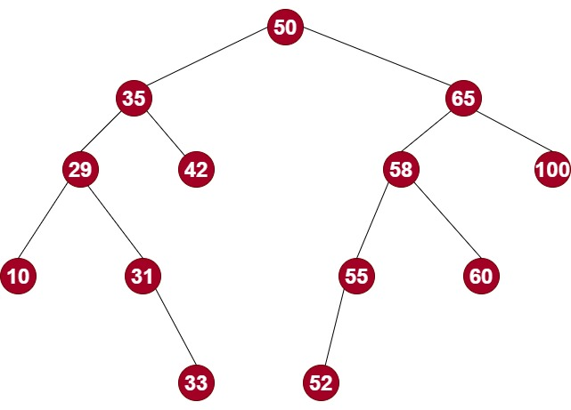
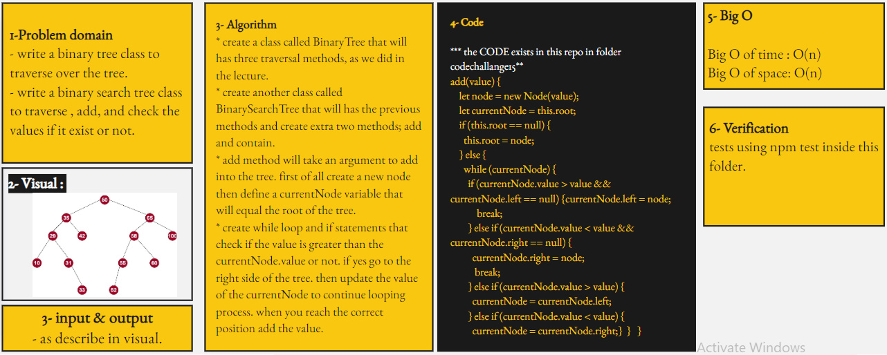

# Trees : Binary Tree and BST Implementation

## Challenge 15

## Binary Trees :

- create Binary tree class that contains preorder, inorder, and postorder traversal methods.

- this tree that used for testing in Binary Trees :
   

  

## Binary Search Trees :

- create Binary Search tree class that contains; add, contain, preorder, inorder, and postorder traversal methods.

- this tree that used for testing in Binary Search Trees :
   

  

## Approach & Efficiency

<!-- What approach did you take? Why? What is the Big O space/time for this approach? -->

## Whiteboard

<!--  -->

## API

<!-- Description of each method publicly available to your Linked List -->
