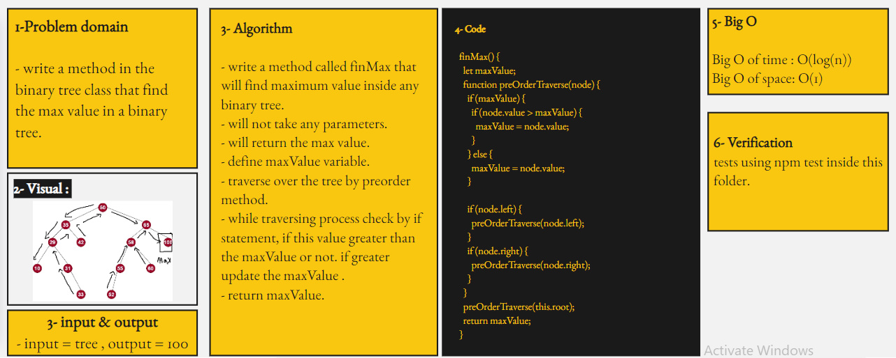

# Binary Tree : tree-max

## Challenge 16

## tree-max :

- create a method in the binary tree class called **findMax** that Find the Maximum Value in a Binary Tree.

   

## Approach & Efficiency

<!-- What approach did you take? Why? What is the Big O space/time for this approach? -->

## Whiteboard

<!--  -->

## API

<!-- Description of each method publicly available to your Linked List -->
