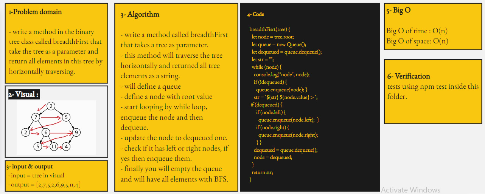

# Binary Tree : Breadth-first Traversal.

## Challenge 17

## tree-breadth-first :

- create a method in the binary tree class called **breadthFirst** that traverse the tree horizontally.

   

## Approach & Efficiency

<!-- What approach did you take? Why? What is the Big O space/time for this approach? -->

## Whiteboard

<!--  -->

## API

<!-- Description of each method publicly available to your Linked List -->
