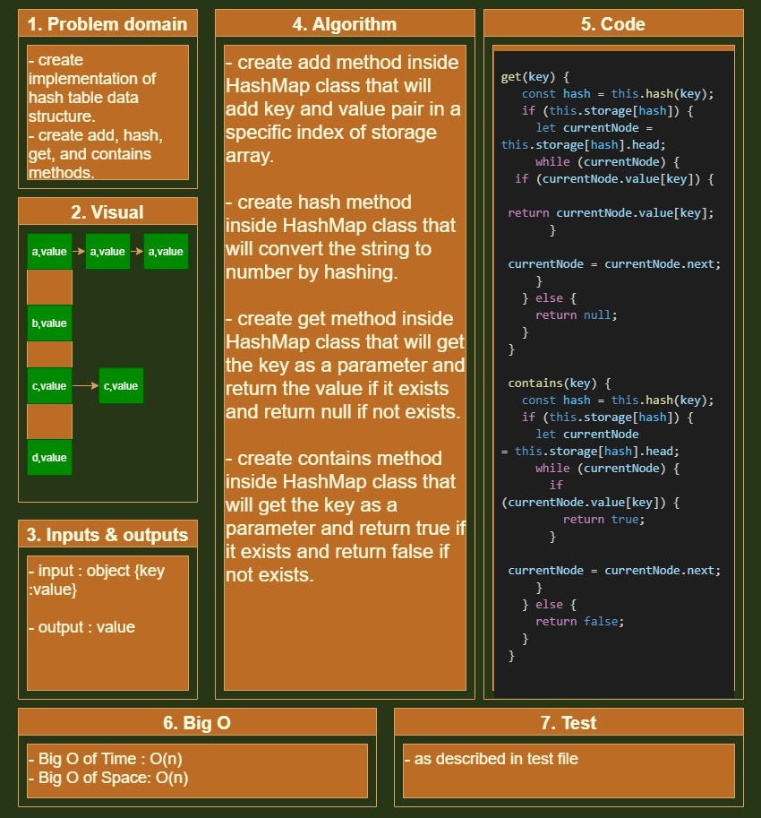

# Implementation: Hash Tables

## Challenge 30

## Hash Tables :

- create the implementation of hash table methods : add, has, get, and contains.

   

## Whiteboard

<!--  -->

## API..

<!-- Description of each method publicly available to your Linked List -->
