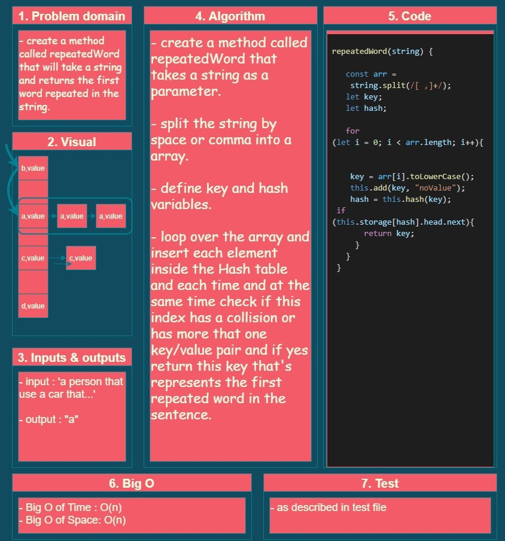

# hashmap-repeated-word

## Challenge 31

## hashmap-repeated-word :

- create a method called **repeatedWord** that is finds the first repeated word in a book.

   

## Whiteboard

<!--  -->

## API..

<!-- Description of each method publicly available to your Linked List -->
