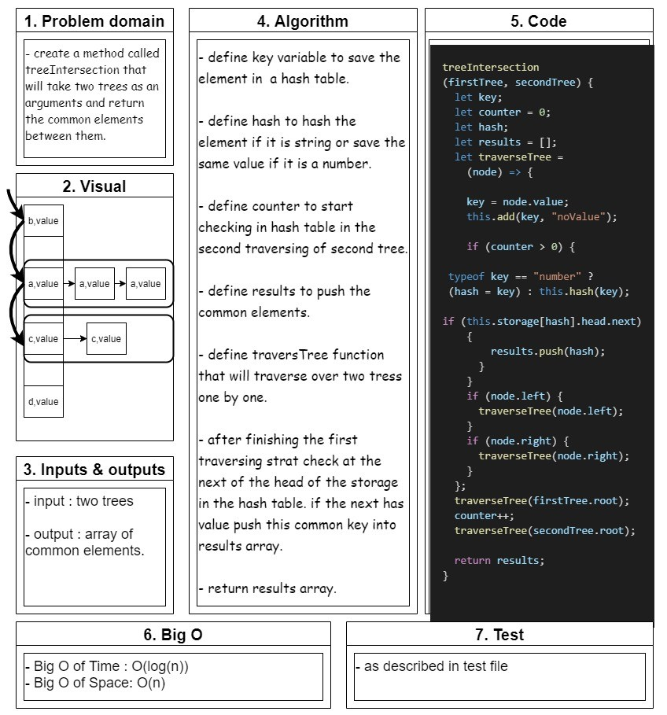

# hashmap-tree-intersection

## Challenge 32

## hashmap-tree-intersection :

- create a method called **treeIntersection** that is Finds the common values in 2 binary trees and return an array.

   

## Whiteboard

<!--  -->

## API..

<!-- Description of each method publicly available to your Linked List -->
