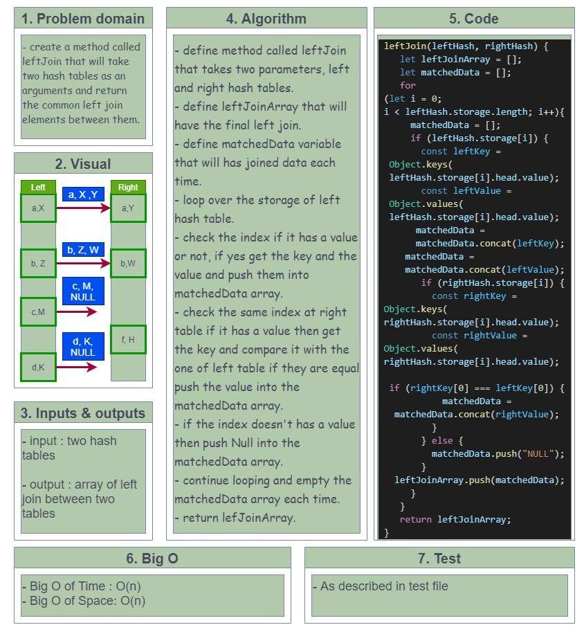

# hashmap-left-join

## Challenge 33

## hashmap-left-join :

- create a method called **leftJoin** that is takes two hashmaps and returns new data, all left hash and the matching ones from right hash.

   

## Whiteboard

<!--  -->

## API..

<!-- Description of each method publicly available to your Linked List -->
