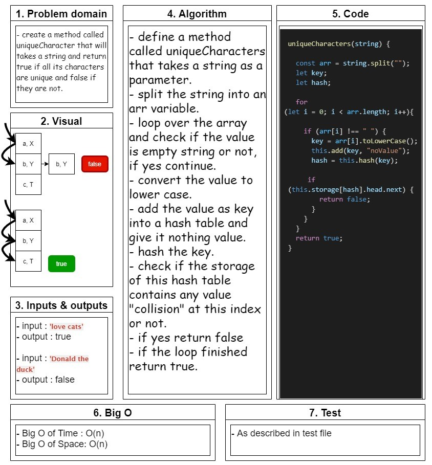

# hashmap-unique characters in string

## Challenge 34 - Mock interview

## unique characteres in string :

- create a method called **uniqueCharacters** that is takes a string and return true if all characters are unique and false if they are not.

   

## Whiteboard

<!--  -->

## API..

<!-- Description of each method publicly available to your Linked List -->
