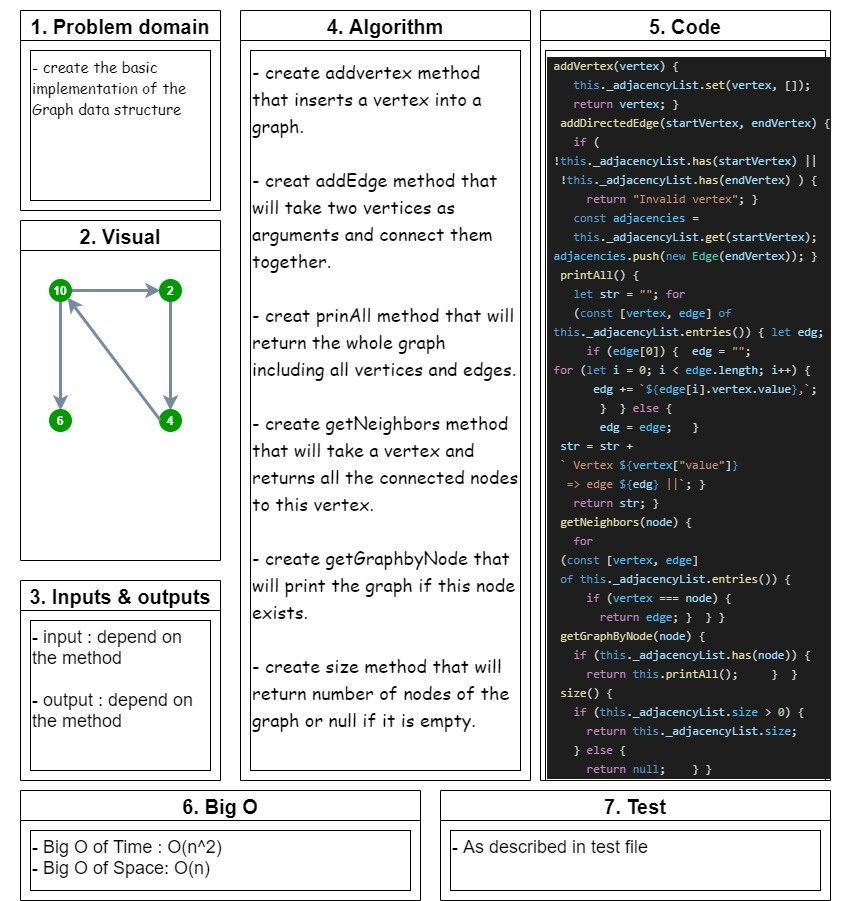

# Implementation: Graphs

## Challenge 35

## implementation of Graph methods :

### >>> create addVertex, addEdge, prinAll, getNeighbors, getGraphByNode, and size methods.

 

## Whiteboard

<!--  -->

<!-- ## API.. -->

<!-- Description of each method publicly available to your Linked List -->
